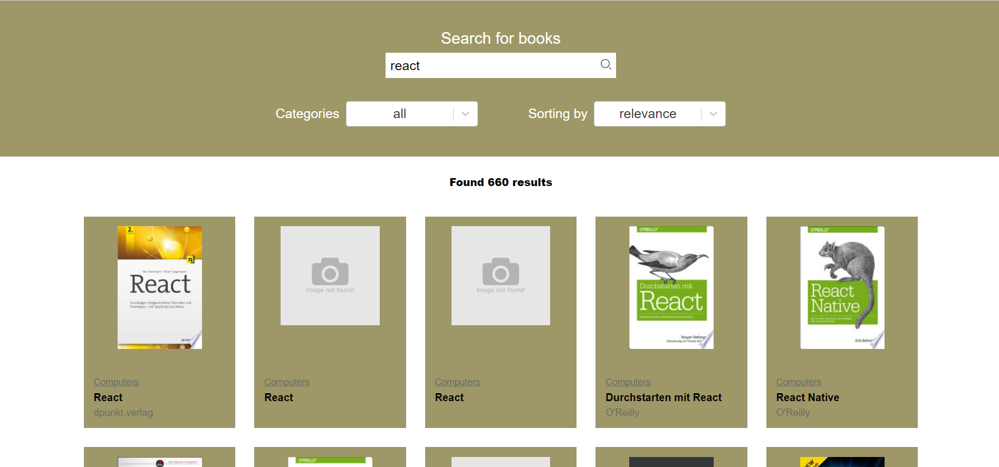
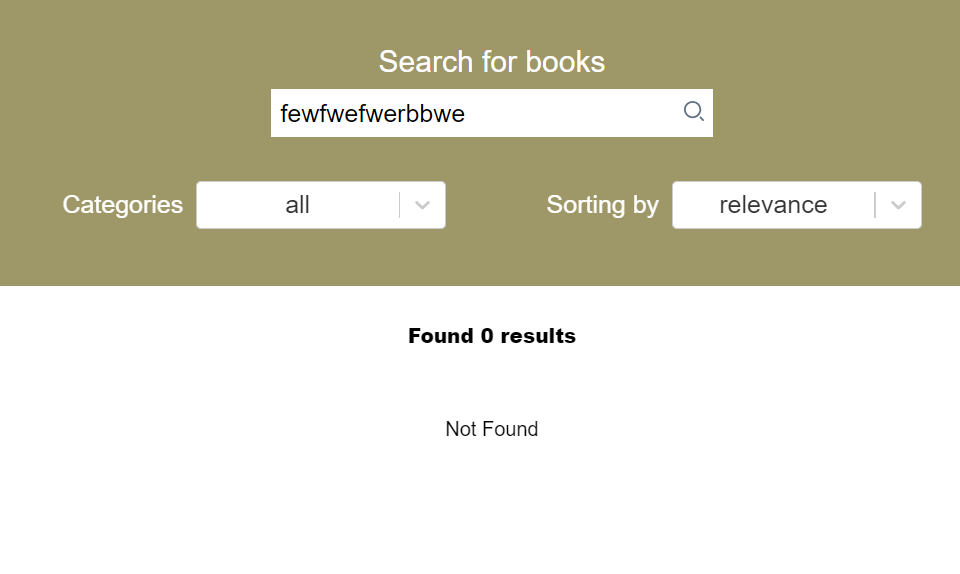

# Search for book

Search for book - реализация тестового задания на основе требование и Google Book Api;

## Technology

1. React;
2. Redux;
3. Axios;
4. Redux Toolkit;
5. TypeScript;
6. React-select;
7. HTML;
8. SASS;

## Description

Приложение обладает функциональностью для поиска и сортировки книг.

- ### Main page

<p align="center"></p>

На главной странице содержится поисковая строка, а также фильтры по категориям и сортировка. В случае отсутсвия кантинки для книги, будет показано not fount img.

- ### Not Found

<p align="center"></p>

В случае отсутствия найденных книг, выдаст ошибку Not Found.


## Getting Started

Для запуска проекта необходимо: !!! Могу возникнуть проблемы с поиском, стоит включить VPN !!!

1. Клонировать репозиторий к себе (средствами git или архивом);
    ```
   git clone https://github.com/NikitaMih/itfactory.git
    ```
2. Установить взаимосвязи и необходимые библиотеки;
    ```
   npm i
    ```
3. Выполнить команду (после выполнения команды, на порту http://localhost:3000 развернется проект);
    ```
   npm start
    ```  
